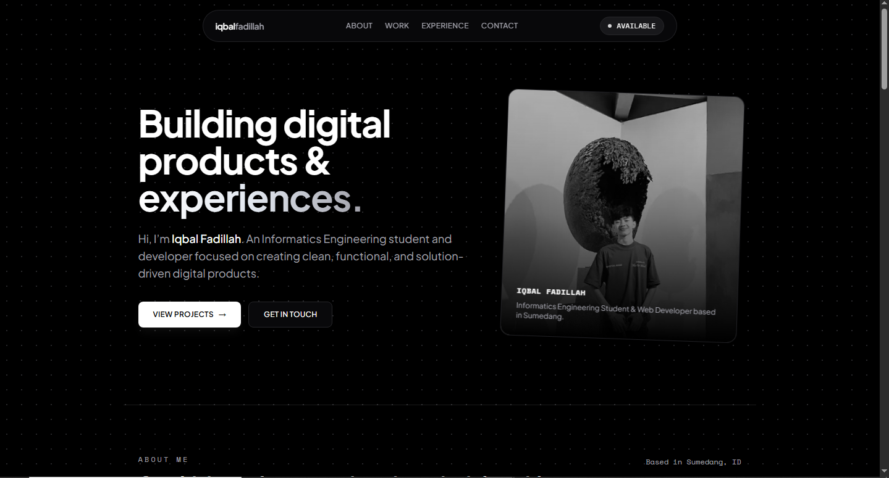

# Iqbal Fadillah — Portfolio

A personal portfolio website showcasing my projects, technical expertise, and professional background as an Informatics Engineering student and Web Developer.

## Overview
This repository contains the source code for my personal portfolio website, built with a focus on clean design, performance, and responsive layout. It serves as a centralized hub for my projects and professional identity.

## Preview

## Tech Stack
* **Markup & Styling:** HTML5, Tailwind CSS
* **Scripting:** Vanilla JavaScript
* **Typography:** Plus Jakarta Sans & Space Mono

## Featured Projects
* **Kreatifin:** A collaborative creative platform built using Laravel and Tailwind CSS.
* **Madani Digital Printing:** A high-performance business landing page optimized for local SEO.

## Live Preview
You can view the live website here: [iqbaalfadillah.vercel.app](https://iqbaalfadillah.vercel.app)

## License
This project is open-source and available under the [MIT License](LICENSE).
